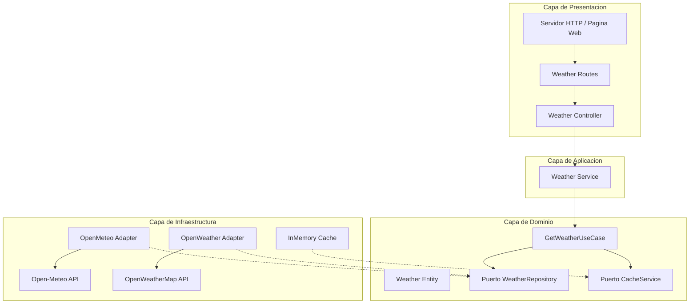
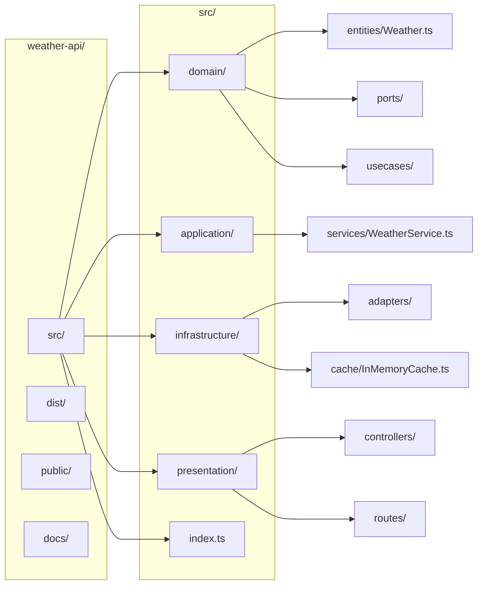
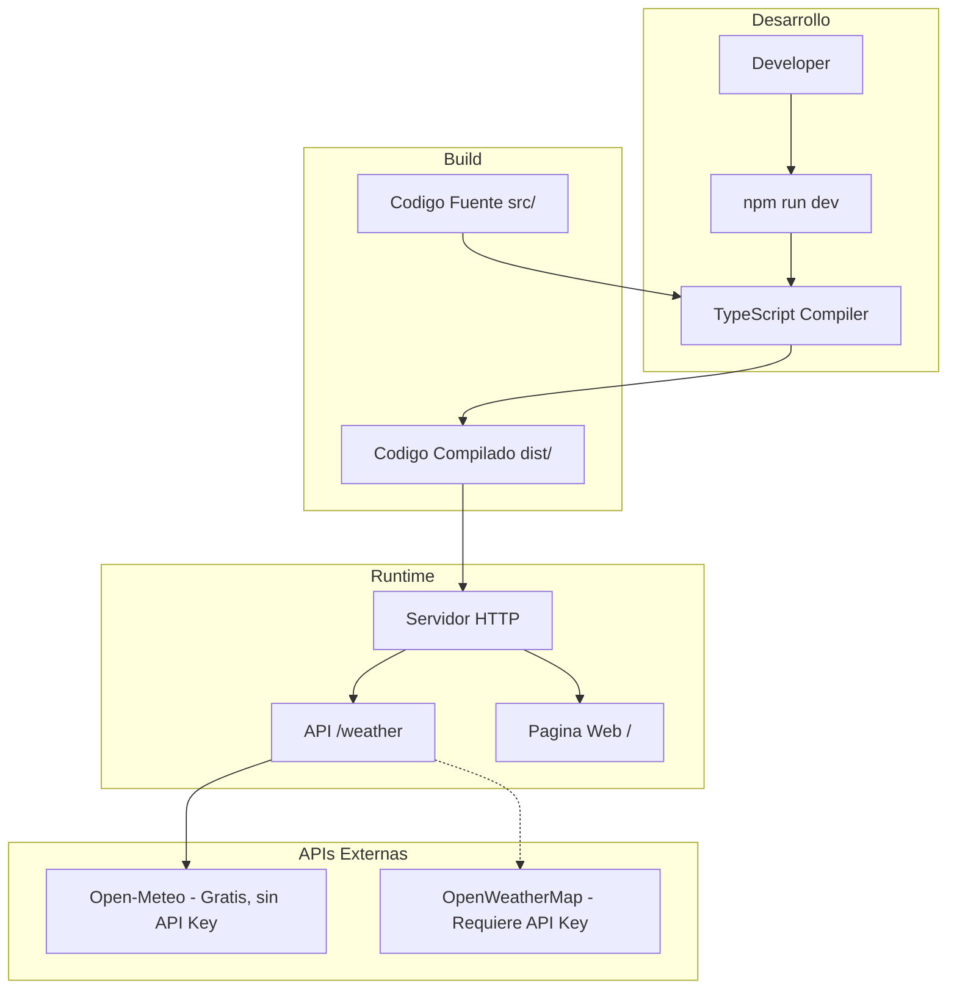
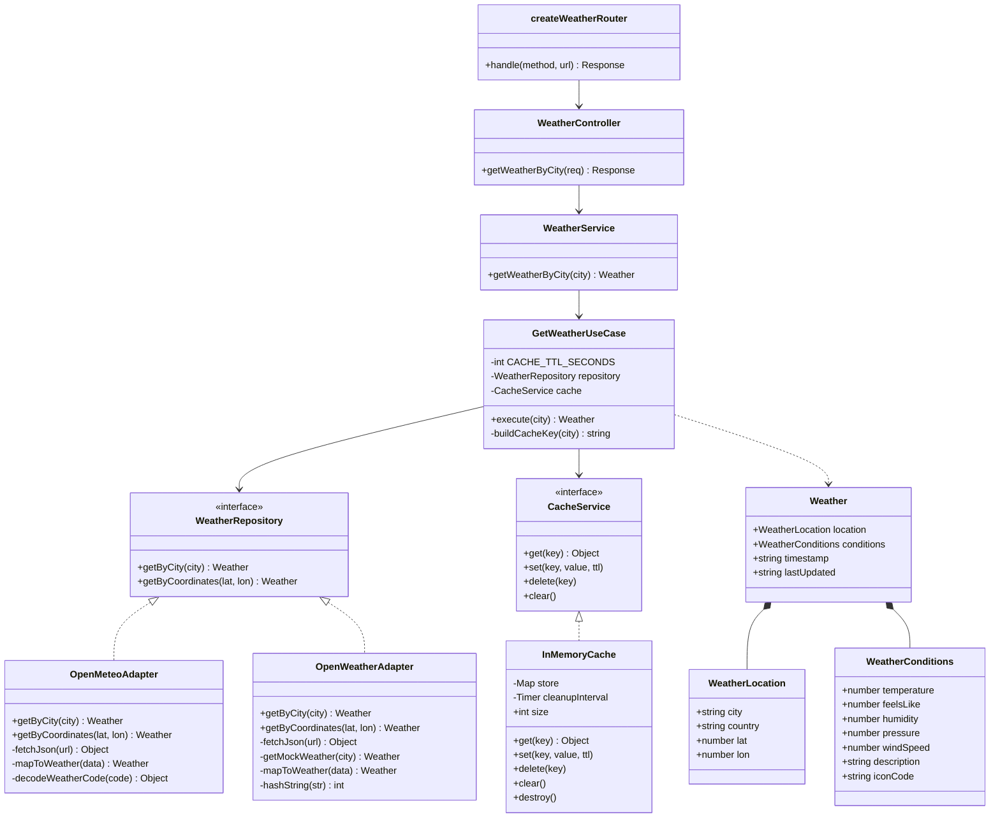
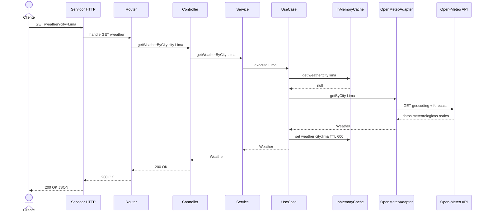
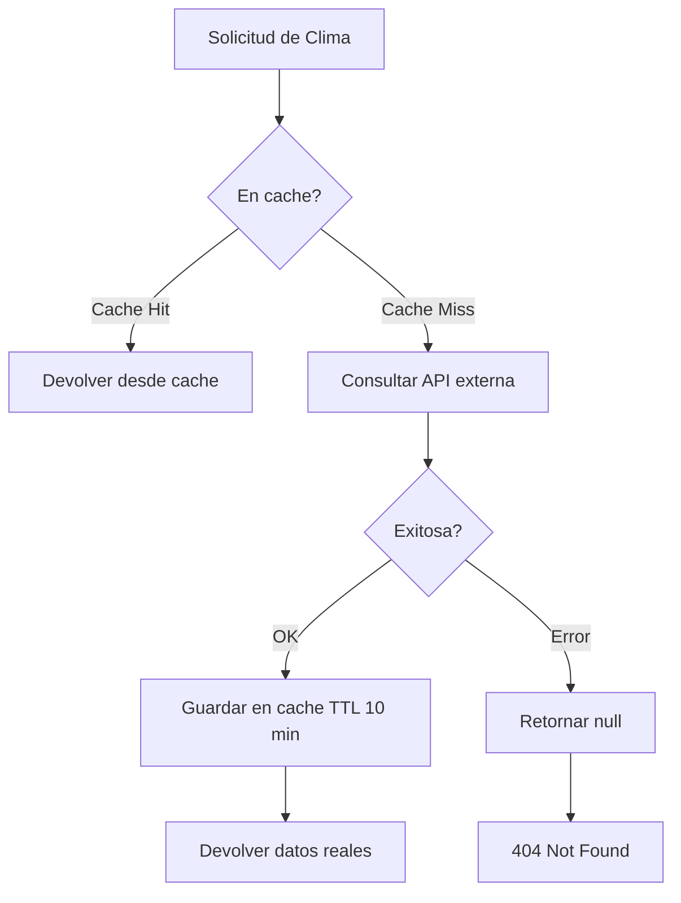

# Weather API — Clean Architecture + Adaptador + Cache-Aside

API REST de clima con datos meteorologicos reales, implementada con **Clean Architecture** y **TypeScript**, usando solo modulos nativos de Node.js (sin frameworks externos).

---

## Tabla de Contenido

1. [Arquitectura del Sistema](#-arquitectura-del-sistema)
2. [Estructura del Proyecto](#-estructura-del-proyecto)
3. [Infraestructura y Despliegue](#-infraestructura-y-despliegue)
4. [Diagrama de Clases](#-diagrama-de-clases)
5. [Flujo de Peticion](#-flujo-de-peticion)
6. [Estrategia de Cache (Cache-Aside)](#-estrategia-de-cache-cache-aside)
7. [Endpoints](#-endpoints)
8. [Configuracion y Ejecucion](#-configuracion-y-ejecucion)
9. [Stack Tecnologico](#-stack-tecnologico)
10. [Adaptadores de Clima](#-adaptadores-de-clima)

---

## Arquitectura del Sistema



### Principios Clean Architecture

| Regla | Implementacion |
|-------|---------------|
| Independencia de Frameworks | Solo `node:http` nativo |
| Independencia de UI | Controladores y rutas separados del dominio |
| Independencia de Base de Datos | Puerto `CacheService` permite cambiar de InMemory a Redis |
| Independencia de Agentes Externos | Puerto `WeatherRepository` con 2 adaptadores intercambiables |
| Regla de Dependencia | Presentacion -> Aplicacion -> Dominio <- Infraestructura |

---

## Estructura del Proyecto



### Descripcion de Capas

| Directorio | Capa | Responsabilidad |
|-----------|------|-----------------|
| `src/domain/entities/` | Dominio | Entidad `Weather` y sus sub-interfaces |
| `src/domain/ports/` | Dominio | Contratos `WeatherRepository`, `CacheService` |
| `src/domain/usecases/` | Dominio | `GetWeatherUseCase` con estrategia cache-aside |
| `src/application/services/` | Aplicacion | `WeatherService` coordina casos de uso |
| `src/infrastructure/adapters/` | Infraestructura | `OpenMeteoAdapter` y `OpenWeatherAdapter` |
| `src/infrastructure/cache/` | Infraestructura | `InMemoryCache` con TTL |
| `src/presentation/controllers/` | Presentacion | `WeatherController` |
| `src/presentation/routes/` | Presentacion | `createWeatherRouter` |
| `src/index.ts` | Composicion | Punto de entrada e inyeccion manual |
| `public/` | Estaticos | Pagina web HTML/CSS/JS |

---

## Infraestructura y Despliegue



### Flujo de Startup

1. `npm start` -> `node dist/index.js`
2. Instancia `InMemoryCache`
3. Instancia `OpenMeteoAdapter` (datos reales, sin API Key)
4. Instancia `GetWeatherUseCase(adapter, cache)`
5. Instancia `WeatherService` -> `WeatherController` -> Router
6. Servidor HTTP en `0.0.0.0:3000`

---

## Diagrama de Clases



---

## Flujo de Peticion



---

## Estrategia de Cache (Cache-Aside)



| Aspecto | Valor |
|---------|-------|
| Patron | Cache-Aside (Lazy Loading) |
| TTL | 600 segundos (10 minutos) |
| Clave | `weather:city:{nombre}` |
| Limpieza | Automatica cada 60s |

---

## Endpoints

### `GET /weather?city={nombre}`

Obtiene el clima actual para una ciudad con datos reales.

| Parametro | Tipo | Requerido | Descripcion |
|-----------|------|-----------|-------------|
| `city` | string | Si | Nombre de la ciudad |

**Respuestas:**

| Codigo | Descripcion |
|--------|-------------|
| 200 | Datos del clima |
| 400 | Falta parametro `city` |
| 404 | Ciudad no encontrada |
| 500 | Error interno |

**Ejemplo (200 OK):**

```json
{
  "location": {
    "city": "Lima",
    "country": "PE",
    "lat": -12.0432,
    "lon": -77.0282
  },
  "conditions": {
    "temperature": 21.7,
    "feelsLike": 16.4,
    "humidity": 40,
    "pressure": 1013,
    "windSpeed": 17.8,
    "description": "cielo despejado",
    "iconCode": "01d"
  },
  "timestamp": "2026-06-10T16:15",
  "lastUpdated": "2026-06-10T21:26:51.093Z"
}
```

### `GET /`

Pagina web interactiva con tarjeta de clima y buscador de ciudades.

---

## Configuracion y Ejecucion

### Requisitos

- Node.js >= 18.x
- npm >= 9.x

### Instalacion

```bash
cd weather-api
npm install
```

### Compilacion

```bash
npm run build
```

### Ejecucion

```bash
npm start
```

No requiere variables de entorno. El adaptador por defecto es **Open-Meteo** que es gratuito y no necesita API Key.

### Usar OpenWeatherMap (requiere API Key)

Para cambiar al adaptador de OpenWeatherMap, modificar `src/index.ts`:

```typescript
import { OpenWeatherAdapter } from "./infrastructure/adapters/OpenWeatherAdapter";
const weatherAdapter = new OpenWeatherAdapter();
```

Y ejecutar con la variable de entorno:

```powershell
$env:OPENWEATHER_API_KEY="tu-api-key"; npm start
```

---

## Stack Tecnologico

| Componente | Tecnologia |
|-----------|-----------|
| Runtime | Node.js |
| Lenguaje | TypeScript 5.7 |
| Servidor HTTP | `node:http` nativo |
| Fetch API | `fetch` nativo (Node 18+) |
| API Principal | Open-Meteo (gratis, sin clave) |
| API Alternativa | OpenWeatherMap (requiere clave) |
| Cache | InMemoryCache (Map + TTL) |
| Frontend | HTML/CSS/JS vanilla |
| Dependencias externas | 0 en produccion |

---

## Adaptadores de Clima

El proyecto incluye **2 adaptadores** que implementan el puerto `WeatherRepository`:

| Adaptador | Fuente de Datos | API Key | Estado |
|-----------|----------------|---------|--------|
| `OpenMeteoAdapter` | Open-Meteo API | No requiere | **Activo por defecto** |
| `OpenWeatherAdapter` | OpenWeatherMap API | Requiere `OPENWEATHER_API_KEY` | Alternativo |

Ambos pueden intercambiarse sin modificar el dominio ni la aplicacion, solo cambiando la composicion en `index.ts`.

### OpenMeteoAdapter

- API gratuita sin limite de peticiones
- Geocodificacion de ciudad a coordenadas
- Datos meteorologicos reales de modelos globales
- Soporte para todos los codigos climaticos WMO

### OpenWeatherAdapter

- API con datos detallados (presion, humedad real, etc.)
- Requiere API Key de OpenWeatherMap
- Incluye fallback mock si la API falla

---

## Principios SOLID

| Principio | Aplicacion |
|-----------|-----------|
| S - Single Responsibility | Cada clase tiene una unica responsabilidad |
| O - Open/Closed | Puertos permiten nuevas implementaciones sin modificar dominio |
| L - Liskov Substitution | Los 2 adaptadores son intercambiables |
| I - Interface Segregation | Puertos pequenos y especificos |
| D - Dependency Inversion | El dominio define puertos, infraestructura los implementa |

---
